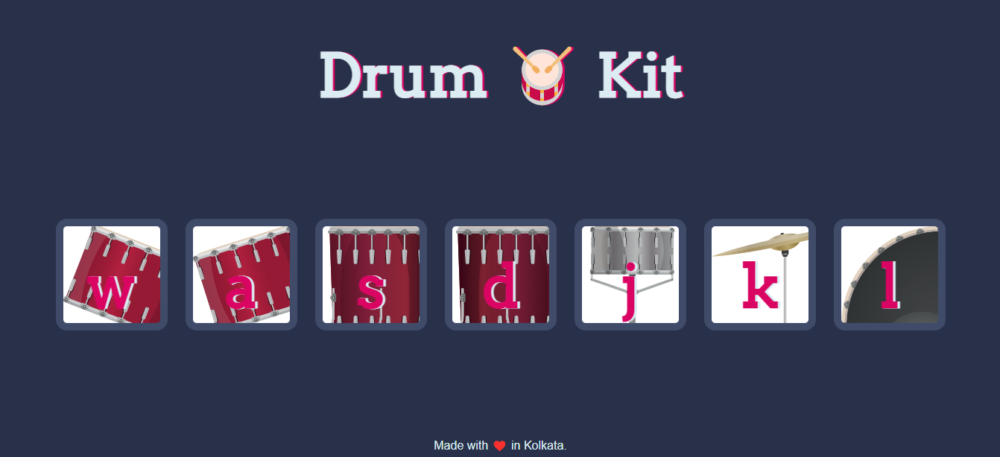

# Virtual Drums 
create your own tunes in this online drum kit
An interactive webpage with implementation of javascript. An entire virtual drum kit is present. Mouse click on the picture generates the sound of that particular kind of drum. Corresponding alphabet keys through the keyboard will also generate sound.

[Click Here to see website - Virtual Drums ](https://manjari-99.github.io/drum/)



## Methodology

#### Index.html
The is the basic web page through which user interacts

Code:
```
<!DOCTYPE html>
<html lang="en" dir="ltr">

<head>
  <meta charset="utf-8">
  <title>Drum Kit</title>
  <link rel="stylesheet" href="styles.css">
  <link href="https://fonts.googleapis.com/css?family=Arvo" rel="stylesheet">
</head>

<body>

  <h1 id="title">Drum 🥁 Kit</h1>
  <div class="set">
    <button class="w drum">w</button>
    <button class="a drum">a</button>
    <button class="s drum">s</button>
    <button class="d drum">d</button>
    <button class="j drum">j</button>
    <button class="k drum">k</button>
    <button class="l drum">l</button>
  </div>


  <footer>
    Lets check the Beats!
  </footer>
  <script src="index.js" charset="utf-8"></script>
</body>

</html>
```

#### Index.js

This file controls the various events and audio with the key triggers.
```
var i;
for (i = 0; i < document.querySelectorAll(".drum").length; i++) {
  document.querySelectorAll(".drum")[i].addEventListener('click', function() {
      makeSound(this.innerHTML);
      buttonAnimation(this.innerHTML);

  })
}

//keyboard press
document.addEventListener('keydown',function(event){
  makeSound(event.key);
  buttonAnimation(event.key);

})

function makeSound(key){
  switch (key) {
    case "w":
      var tom1 = new Audio('tom-1.mp3');
      tom1.play();

      break;
    case "a":
      var tom2 = new Audio('tom-2.mp3');
      tom2.play();
      break;
    case "s":
      var tom3 = new Audio('tom-3.mp3');
      tom3.play();
      break;
    case "d":
      var tom4 = new Audio('tom-4.mp3');
      tom4.play();
      break;
    case "j":
      var snare = new Audio('snare.mp3');
      snare.play();
      break;
    case "k":
      var crash = new Audio('crash.mp3');
      crash.play();
      break;
    case "l":
      var kick = new Audio('kick-bass.mp3');
      kick.play();
      break;
    default: console.log(this.innerHTML);

  }

}

function buttonAnimation(currentkey){
  var activekey = document.querySelector("."+currentkey);
  activekey.classList.add("pressed");
  setTimeout(function(){
    activekey.classList.remove("pressed")
  }, 200);

}
```

## Conclusion 
This project was a hands on for learning the basics of html, css and javascript. The basic Foundation for web development.
[Click here to access Github Repo](https://github.com/Manjari-99/drum.git)
